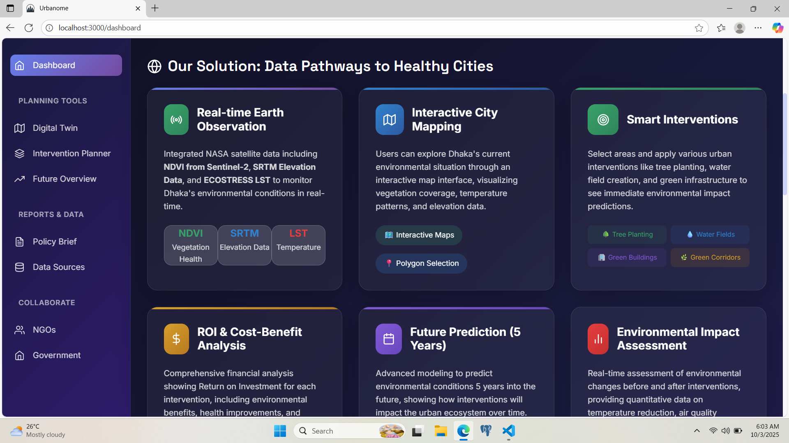

# 🏥 SMART SATELLITE BASED PUBLIC HEALTH MANAGEMENT SYSTEM

### 🌍 Project Overview
An integrated, technology-enabled Smart Public Health Management System designed for the Solapur Municipal Corporation (SMC). This comprehensive application leverages environmental data and advanced analytics to develop strategic approaches for sustainable urban health management. The system provides real-time disease surveillance, infrastructure monitoring, and localized risk assessments. By visualizing ward-wise health indicators on an interactive Digital Twin of Solapur, and predicting public health risks, the platform enables municipal authorities, health workers, and communities to make informed, data-driven decisions that improve healthcare accessibility and early outbreak detection.

### 🎯 Description
**One-Line Problem Statement**
Design and develop an integrated, technology-enabled Smart Public Health Management System for Solapur Municipal Corporation (SMC) to improve healthcare accessibility, disease surveillance, infrastructure monitoring, and citizen engagement through data-driven and real-time digital solutions.

#### Context
Solapur Municipal Corporation serves a rapidly expanding urban population with diverse healthcare needs. Despite ongoing public health initiatives, the city continues to face challenges such as unequal access to healthcare services, delayed outbreak detection, fragmented health data systems, limited preventive healthcare awareness, and lack of real-time visibility into public health infrastructure. 
The COVID-19 pandemic further highlighted the importance of real-time, integrated, and technology-driven healthcare systems to strengthen preventive care, emergency response, and informed decision-making at the municipal level.

#### Problem Description
Solapur Municipal Corporation requires a unified digital health ecosystem to address the following challenges:

1. **Fragmented Health Data and Limited Visibility**
   • Health data is siloed across hospitals, clinics, laboratories, and government programs.
   • Absence of standardized, real-time health data analytics for planning and monitoring.
   • Limited ward-wise and zone-wise visibility of health indicators.

2. **Delayed Disease Detection and Response**
   • Inadequate predictive systems for early detection of disease outbreaks.
   • Lack of real-time surveillance for communicable and non-communicable diseases.
   • Difficulty in identifying high-risk populations and vulnerable zones.

3. **Limited Citizen-Centric Digital Health Services**
   • Insufficient digital platforms for appointments, telemedicine, vaccination alerts, and emergency services.
   • Low awareness and engagement in preventive healthcare and wellness programs.
   • Limited accessibility for diverse and multilingual populations.

4. **Inefficient Monitoring of Public Health Infrastructure**
   • Lack of real-time tracking of hospital bed availability, equipment condition, and medicine stocks.
   • Manual processes reduce efficiency, transparency, and accountability.

#### 🚀 Live Web Application

To view the webpage kindly visit: https://aheadlybygoddamn.netlify.app/

### 📊 Dashboard



### 🚀 Key Features

#### 1. City Intelligence Center
- **Real-Time Monitoring**: Live tracking of the Health Risk Index (HRI), Critical Wards, Heat Hotspots, and Stagnation Risks.
- **Disease Surveillance**: Identification of active disease signals and high-risk populations.
- **Live Metrics**: At-a-glance visualization of the city's overall health status and active citizen reports over the past 7 days.

#### 2. Digital Twin & Risk Heatmap
- **Ward-wise Visibility**: Interactive map detailing Solapur Wards and their specific spatial risk levels.
- **Environmental Tracking**: Monitoring variables critical to public health like open drains and stagnant water zones.
- **Vulnerability Zones**: Clear demarcation of high-risk areas requiring immediate municipal intervention.

#### 3. Community Sanitation & Citizen Reporting
- **Issue Tracking**: Digital platform for tracking community-reported "Uncollected Garbage", "Open Drains", "Stagnant Water", and "Overflowing Public Bins".
- **Risk Aggregation**: Automatic calculation of sector risk (High, Medium, Low) based on the frequency and density of sanitation issues.

#### 4. Intervention Planning & Health Strategy
- **Simulation Tools**: Modeling the potential impact of public health and sanitation interventions.
- **Data-Driven Strategy**: Prioritizing resources based on live data triggers and automated risk assessments.

### 🛠 Tech Stack
- **Frontend**: React.js with modern hooks and Context API
- **Styling**: Styled-Components & Framer Motion for high-performance, dynamic UI animations
- **Maps**: Leaflet.js & React-Leaflet for interactive geographic mapping and GeoJSON rendering of Solapur wards
- **Visualization**: Chart.js & Recharts for advanced data analytics and metric tracking
- **Deployment**: Netlify

### 🏗 Project Structure
```text
smart-public-health-system/
├── client/                 # React frontend application
│   ├── public/             # Static assets & GeoJSON spatial data
│   ├── src/                
│   │   ├── components/     # Reusable UI components & Map layers
│   │   ├── pages/          # Application views (Dashboard, Digital Twin, etc.)
│   │   ├── services/       # Services for disease signals and data metrics
│   │   └── utils/          # State managers & community sanitation tracking
```

### 🌟 Deliverables
1. **Interactive City Dashboard**: Real-time public health and environmental monitoring interface.
2. **Citizen Reporting Mechanism**: Seamless aggregation of sanitation and civic health issues.
3. **Digital Twin Heatmap**: Sector-wise spatial assessment for early disease outbreak detection.
4. **Intervention Planner**: Data-enabled modeling tools for strategic resource allocation.

### 🌏 Focus Areas
- **Solapur, Maharashtra**: Comprehensive integration of municipal data to ensure equitable healthcare access, rapid response capabilities, and improved overall public health outcomes across Solapur Municipal Corporation boundaries.

### 📈 Impact Metrics
- Reduction in disease outbreak detection time
- Improved resolution rates for critical community sanitation issues
- Enhanced real-time visibility of health and civic infrastructure
- Increased citizen engagement through streamlined digital reporting
