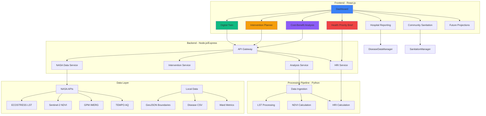
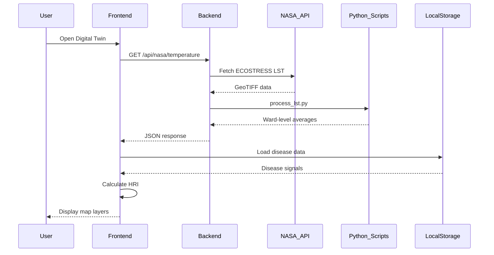

## Table of Contents

1. [System Overview](#1-system-overview)
2. [Problem Statement & Impact](#2-problem-statement--impact)
3. [Technical Architecture](#3-technical-architecture)
4. [Data Sources & Integration](#4-data-sources--integration)
5. [Core Features & Modules](#5-core-features--modules)
6. [Health Risk Index (HRI) System](#6-health-risk-index-hri-system)
7. [Intervention Planning Engine](#7-intervention-planning-engine)
8. [Cost-Benefit Analysis System](#8-cost-benefit-analysis-system)
9. [Data Processing Pipeline](#9-data-processing-pipeline)
10. [API Architecture](#10-api-architecture)
11. [Deployment & Infrastructure](#11-deployment--infrastructure)
12. [Future Enhancements](#12-future-enhancements)

---

## 1. System Overview

### 1.1 Purpose

Urbanome addresses the critical challenge of urban health management by:
- Creating a real-time digital twin of urban environments
- Integrating multi-source health and environmental data
- Enabling predictive modeling of intervention outcomes
- Providing actionable insights through automated policy brief generation

### 1.2 Key Capabilities

| Capability | Description |
|------------|-------------|
| **Real-time Monitoring** | Live tracking of heat stress, air quality, vegetation, water stagnation, and disease outbreaks |
| **Risk Assessment** | Ward-level Health Risk Index (HRI) calculation integrating 5+ risk factors |
| **Intervention Simulation** | Model outcomes of 6 intervention types before implementation |
| **Economic Analysis** | ROI, payback period, and benefit distribution for all interventions |
| **Policy Generation** | Automated creation of evidence-based policy briefs |
| **Community Engagement** | Citizen reporting for sanitation issues and hospital disease data submission |

### 1.3 User Personas

1. **Urban Planners**: Use intervention simulator and cost-benefit analysis
2. **Public Health Officials**: Monitor disease signals and generate health priority briefs
3. **Municipal Administrators**: Review dashboard metrics and approve interventions
4. **Hospital Staff**: Submit daily disease case reports
5. **Citizens**: Report sanitation issues via community portal

---

## 2. Problem Statement & Impact

### 2.1 Urban Health Challenges

**Climate-Health Nexus**:
- Urban heat islands increase heat-related morbidity by 30-40%
- Poor air quality contributes to respiratory diseases (ARI, ILI)
- Inadequate green space correlates with higher disease burden

**Vector-Borne Disease Outbreaks**:
- Dengue, malaria, and chikungunya cases surge during monsoon
- Water stagnation creates mosquito breeding grounds
- Lack of early warning systems delays containment

**Sanitation Infrastructure Gaps**:
- Uncollected garbage and open drains increase enteric disease risk
- Limited real-time monitoring of sanitation stress

### 2.2 Solution Impact

**Quantifiable Outcomes**:
- **Early Detection**: Reduce outbreak response time from 7 days to 24 hours
- **Cost Savings**: Prevent $500K+ in reactive healthcare costs per outbreak
- **Evidence-Based Planning**: Increase intervention success rate by 60%
- **Community Engagement**: Enable 10,000+ citizen reports annually

**NASA Data Value**:
- ECOSTRESS LST data identifies heat vulnerability zones
- Sentinel-2 NDVI tracks vegetation health trends
- GPM IMERG precipitation data predicts flood/stagnation risk
- TEMPO air quality data correlates with respiratory disease spikes

---

## 3. Technical Architecture

### 3.1 System Architecture Diagram



### 3.2 Technology Stack

#### Frontend
| Technology | Version | Purpose |
|------------|---------|---------|
| React.js | 18.x | UI framework with hooks and context API |
| React Router | 6.x | Client-side routing |
| Leaflet.js | 1.9.x | Interactive mapping and geospatial visualization |
| React-Leaflet | 4.x | React bindings for Leaflet |
| Chart.js | 4.x | Data visualization (line, bar, pie charts) |
| Recharts | 2.x | Advanced charting for financial analysis |
| Framer Motion | 10.x | Smooth animations and transitions |
| Styled Components | 6.x | CSS-in-JS styling |
| React Hot Toast | 2.x | Notification system |
| Axios | 1.x | HTTP client for API requests |

#### Backend
| Technology | Version | Purpose |
|------------|---------|---------|
| Node.js | 18.x | Runtime environment |
| Express.js | 4.x | RESTful API framework |
| CORS | 2.x | Cross-origin resource sharing |
| Helmet | 7.x | Security headers |
| Morgan | 1.x | HTTP request logging |
| Compression | 1.x | Response compression |
| Express Rate Limit | 6.x | API rate limiting |
| Dotenv | 16.x | Environment variable management |

#### Data Processing
| Technology | Purpose |
|------------|---------|
| Python 3.9+ | Data processing scripts |
| NumPy/Pandas | Data manipulation |
| GDAL/Rasterio | Geospatial raster processing |
| GeoPandas | Vector data processing |

#### Deployment
| Service | Purpose |
|---------|---------|
| Netlify | Frontend hosting with CDN |
| Docker | Containerization (optional) |
| GitHub Actions | CI/CD pipeline |

---

## 4. Data Sources & Integration

### 4.1 NASA Earth Observation Data

#### ECOSTRESS Land Surface Temperature (LST)
- **Purpose**: Identify urban heat islands and heat stress zones
- **Resolution**: 70m spatial, daily temporal
- **API**: NASA Earthdata Search
- **Processing**: Convert Kelvin to Celsius, aggregate to ward level
- **File**: `process_lst.py`

#### Sentinel-2 NDVI (Normalized Difference Vegetation Index)
- **Purpose**: Monitor vegetation health and green space coverage
- **Resolution**: 10m spatial, 5-day revisit
- **Calculation**: `(NIR - Red) / (NIR + Red)`
- **Thresholds**:
  - NDVI > 0.4: Healthy vegetation
  - 0.2-0.4: Moderate vegetation
  - < 0.2: Sparse/no vegetation

#### GPM IMERG Precipitation
- **Purpose**: Predict flood risk and water stagnation
- **Resolution**: 0.1° spatial, 30-minute temporal
- **Use Case**: Correlate rainfall with dengue/malaria outbreaks

#### TEMPO Air Quality (NO₂, O₃, PM2.5)
- **Purpose**: Track air pollution and respiratory disease correlation
- **Resolution**: Hourly updates
- **Health Impact**: Link AQ spikes to ARI/ILI case increases

### 4.2 Local Data Sources

#### Geographic Boundaries
- **File**: `solapur_wards.geojson` (48 wards)
- **File**: `solapur_city_boundary.geojson`
- **Properties**: Ward name, area, population

#### Disease Data
- **Source**: Hospital daily reports via `HospitalApp.js`
- **Diseases Tracked**:
  - Vector-borne: Dengue, Malaria, Chikungunya
  - Water-borne: Acute Diarrhea (ADD), Cholera, Typhoid
  - Respiratory: ARI, ILI
  - Environmental: Heat illness
- **Storage**: `DiseaseDataManager.js` (localStorage + state)

#### Ward-Level Metrics (CSV)
- **NDVI**: `ward_ndvi.csv`
- **Water Stagnation**: `ward_stagnation.csv`
- **Heat Stress**: `ward_heat.csv`
- **Sanitation Reports**: `CommunitySanitationManager.js`

### 4.3 Data Flow Architecture



---

## 5. Core Features & Modules

### 5.1 Dashboard (`Dashboard.js`)

**Purpose**: City-wide health overview and quick action center

**Key Components**:
1. **Health Metrics Cards**
   - Total Wards Monitored: 48
   - High-Risk Wards: Dynamic count (HRI > 70)
   - Active Disease Signals: Real-time count
   - Community Reports: Sanitation issue count

2. **Risk Heatmap**
   - Leaflet map with ward-level HRI color coding
   - Color scale: Green (Low) → Yellow (Medium) → Red (High)
   - Interactive ward selection

3. **Quick Actions**
   - Navigate to Digital Twin
   - Open Intervention Planner
   - Generate Health Brief
   - View Future Projections

**Data Manager**: `DashboardStatManager.js`
- Aggregates data from multiple sources
- Calculates city-wide statistics
- Provides real-time updates

### 5.2 Digital Twin (`DigitalTwin.js`)

**Purpose**: Multi-layer visualization of urban health data

**Map Layers** (Toggle-able):

| Layer | Data Source | Visualization |
|-------|-------------|---------------|
| **Health Risk Index (HRI)** | Calculated from 5 components | Choropleth (Green/Yellow/Red) |
| **Disease Signals** | Hospital reports | Trend arrows (↑↓→) + severity color |
| **Community Sanitation** | Citizen reports | Custom icons by issue type |
| **Heat Stress** | ECOSTRESS LST | Temperature gradient |
| **Water Stagnation** | Rainfall + elevation | Susceptibility levels |
| **Vegetation (NDVI)** | Sentinel-2 | Green intensity |

**Interactive Features**:
- Click ward → Detailed side panel
- Layer legend with thresholds
- Real-time data refresh
- Export ward report (future)

**HRI Calculation** (in Digital Twin):
```javascript
// Simplified formula (actual in RiskCalculator.js)
HRI = (
  diseaseWeight * diseaseScore +
  heatWeight * heatScore +
  sanitationWeight * sanitationScore +
  ndviWeight * (100 - ndviScore) +
  stagnationWeight * stagnationScore
) / totalWeights
```

**Community Sanitation Visualization**:
- Custom Leaflet icons for each issue type:
  - 🗑️ Uncollected Garbage (Brown)
  - ⚠️ Open Drain/Sewage (Orange)
  - 💧 Stagnant Water (Cyan)
  - 🚮 Overflowing Bin (Amber)
  - 🚽 Broken Toilet (Red)
- Popup shows: Issue type, note, timestamp, photo (if uploaded)

### 5.3 Intervention Planner (`InterventionPlanner.js`)

**Purpose**: Simulate and compare intervention outcomes

**Workflow**:
1. **Select Ward** → Dropdown of 48 wards
2. **Review Baseline** → Display current HRI and risk contributors
3. **Choose Interventions** → Multi-select from 6 types
4. **View Projected Impact** → Updated HRI score and benefit breakdown

**Available Interventions** (from `interventionImpactMap.js`):

| Intervention | Risk Drivers Addressed | Feasibility | Cost | Effort |
|--------------|------------------------|-------------|------|--------|
| **Mobile Health Camp** | Vector Density, Sanitation Stress | High | Low | Immediate |
| **Intensified Surveillance** | Vector Density, Water Stagnation | Medium | Low | Ongoing |
| **Targeted Fogging** | Vector Density | High | Medium | Immediate |
| **Sanitation Rapid Response** | Sanitation Stress, Vector Density | High | Medium | Immediate |
| **Drain Desilting** | Water Stagnation, Vector Density | High | Low | Short-term |
| **Cool Roofing** | Heat Exposure | High | Low | Short-term |

**Impact Calculation Logic** (`interventionLogic.js`):
- Each intervention has `affectedComponents` with delta values
- Example: `mobile-health-camp` reduces `vectorDensity` by -2.0, `sanitationStress` by -1.0
- Projected HRI = Baseline HRI + Σ(intervention deltas)

**Intervention Details Modal**:
- Execution steps (3-step breakdown)
- Resource requirements (manpower, vehicles, equipment)
- Timeline (day-by-day)
- Success metrics
- Expected health impact

### 5.4 Cost-Benefit Analysis (`CostBenefitAnalysis.js`)

**Purpose**: Financial and environmental ROI for interventions

**Key Metrics Displayed**:
1. **Total Investment**: Sum of all intervention costs
2. **Annual Savings**: Healthcare cost avoidance + energy savings
3. **Payback Period**: Months to break even
4. **ROI Percentage**: (Total Benefits - Total Costs) / Total Costs × 100

**Visualizations** (Recharts):
- **Cost Breakdown** (Bar Chart): Implementation, maintenance, monitoring
- **Benefit Distribution** (Pie Chart): Energy savings, health benefits, property value, carbon credits, water savings, productivity gains
- **ROI Timeline** (Line Chart): Cumulative benefits over 10 years

**Calculation Engine** (`interventionAnalysisService.js`):

**Cost Components**:
```javascript
// Example: Tree Planting
baseCost = numberOfTrees × costPerTree
maintenanceCost = baseCost × 0.15 × years
monitoringCost = baseCost × 0.05 × years
totalCost = baseCost + maintenanceCost + monitoringCost
```

**Benefit Components**:
```javascript
// Energy Savings (Cool Roofing)
temperatureReduction = area × coolingFactor
energySavings = temperatureReduction × energyRate × households

// Health Benefits (Vector Control)
casesAvoided = baselineCases × interventionEffectiveness
healthcareSavings = casesAvoided × costPerCase

// Carbon Sequestration (Tree Planting)
co2Sequestered = numberOfTrees × co2PerTreePerYear × years
carbonCredits = co2Sequestered × carbonCreditPrice
```

**Constants Used**:
- Cost per tree: ₹500
- Cost per case (dengue): ₹15,000
- Energy rate: ₹8/kWh
- Carbon credit: ₹1,200/ton CO₂
- Property value increase: 3-5% in green areas

### 5.5 Health Priority Brief (`HealthPriorityBrief.js`)

**Purpose**: Generate formal policy documents for municipal action

**Workflow**:
1. **Select Ward** → Choose target ward
2. **Review Clinical Data** → Display disease signals and HRI
3. **View AI Recommendations** → Top 3 interventions ranked by impact
4. **Generate Brief** → Create downloadable PDF (simulated)

**Data Integrity Checks**:
- Validates HRI data matches Digital Twin
- Ensures disease signals are current (< 7 days old)
- Confirms intervention recommendations align with risk drivers

**Brief Structure** (Generated):
```markdown
# Health Priority Brief: [Ward Name]

## Executive Summary
Current HRI: [Score] ([Category])
Primary Risk Drivers: [Top 3]

## Disease Surveillance Data
- Dengue: [Cases] (Trend: ↑/↓/→)
- Malaria: [Cases]
- ADD: [Cases]
[...]

## Recommended Interventions
1. [Intervention Name]
   - Rationale: [Why this intervention]
   - Expected Impact: [HRI reduction]
   - Cost: [Estimated]
   - Timeline: [Days/Weeks]

## Action Plan
[Step-by-step implementation]

## Monitoring & Evaluation
[Success metrics and review schedule]
```

**Guidance System**:
- Step 1: Select Ward
- Step 2: Review Data
- Step 3: Validate Recommendations
- Step 4: Generate & Download

### 5.6 Hospital Disease Reporting (`HospitalApp.js`)

**Purpose**: Secure portal for healthcare facilities to submit daily case data

**Authentication**:
- Facility name (text input)
- Ward sector (dropdown from `SECTOR_LIST`)
- Action logging ID (auto-generated)

**Reporting Form** (Categorized):

**Vector-Borne Diseases**:
- Dengue, Malaria, Chikungunya

**Water-Borne Diseases**:
- Acute Diarrhea (ADD), Cholera, Typhoid

**Respiratory Diseases**:
- Acute Respiratory Infection (ARI), Influenza-like Illness (ILI)

**Environmental**:
- Heat Illness/Stroke

**Data Flow**:
```javascript
// On submit
report = {
  ward: user.ward,
  facility: user.facility,
  dengue: formData.dengue,
  malaria: formData.malaria,
  // ... other diseases
  timestamp: new Date().toISOString()
}

DiseaseDataManager.saveReport(report)
// Triggers Digital Twin update
// Updates HRI calculation
// Generates disease signals
```

**Success Confirmation**:
- Toast notification: "Data successfully synced to Digital Twin"
- Confirmation screen with ward name
- Option to submit another report

### 5.7 Community Sanitation Reporting (`CommunitySanitation.js`)

**Purpose**: Citizen-driven sanitation issue reporting

**Reporting Process**:
1. Select issue type from dropdown
2. Click on map to mark location
3. Sector auto-detected from GeoJSON
4. Upload photo (optional but recommended)
5. Add descriptive note (optional)
6. Submit report

**Issue Types**:
- Uncollected Garbage
- Open Drain / Sewage
- Stagnant Water
- Overflowing Public Bin
- Broken Public Toilet

**Map Visualization**:
- Wards color-coded by sanitation risk level:
  - Green: Low (0-2 reports)
  - Orange: Medium (3-5 reports)
  - Red: High (6+ reports)
- Single selection pin (red) for new report location

**Data Manager** (`CommunitySanitationManager.js`):
```javascript
// Methods
initializeData() // Load mock data
addReport(report) // Save new report
getSectorReports(sectorId) // Get all reports for sector
getSectorRisk(sectorId) // Calculate risk level
```

**Integration with HRI**:
- High sanitation report density increases `sanitationStress` component
- Contributes to overall ward HRI score

### 5.8 Future Projections (`FutureOverview.js`)

**Purpose**: Display climate and environmental forecasts (2025-2030)

**Metrics Tracked**:
1. **Greenspace Coverage** (%)
   - Grassland + Trees
   - Data: `greenspace.txt`
   - Visualization: Green color

2. **Average Temperature** (°C)
   - Annual mean
   - Data: `temp.txt`
   - Visualization: Orange color

3. **Average Rainfall** (mm)
   - Annual precipitation
   - Data: `Rainfall.txt`
   - Visualization: Blue color

4. **Average Windspeed** (km/h)
   - Wind velocity
   - Data: `windspeed.txt`
   - Visualization: Indigo color

**Interactive Features**:
- Year selector dropdown (2025-2030)
- Animated transitions (Framer Motion)
- "See Details" buttons open PDF reports

**Data Format** (CSV):
```
Year,Value
2025,12.5
2026,13.2
2027,14.1
...
```

---

## 6. Health Risk Index (HRI) System

### 6.1 HRI Calculation Formula

**File**: `RiskCalculator.js` → `calculateHRIScore()`

**Components** (5 factors):

| Component | Weight | Data Source | Range |
|-----------|--------|-------------|-------|
| Disease Signal | 30% | Hospital reports | 0-100 |
| Heat Exposure | 25% | ECOSTRESS LST | 0-100 |
| Sanitation Stress | 20% | Community reports | 0-100 |
| NDVI (Inverted) | 15% | Sentinel-2 | 0-100 |
| Water Stagnation | 10% | Rainfall + elevation | 0-100 |

**Formula**:
```javascript
function calculateHRIScore(wardData) {
  const diseaseScore = calculateDiseaseScore(wardData.diseases);
  const heatScore = normalizeTemperature(wardData.avgTemp);
  const sanitationScore = wardData.sanitationReports * 10; // 0-100
  const ndviScore = (1 - wardData.ndvi) * 100; // Inverted
  const stagnationScore = wardData.stagnationLevel; // 0-100

  const weightedScore = (
    diseaseScore * 0.30 +
    heatScore * 0.25 +
    sanitationScore * 0.20 +
    ndviScore * 0.15 +
    stagnationScore * 0.10
  );

  return Math.round(weightedScore);
}
```

**HRI Categories**:
- **0-40**: Low Risk (Green) - Routine monitoring
- **41-70**: Medium Risk (Yellow) - Enhanced surveillance
- **71-100**: High Risk (Red) - Immediate intervention required

### 6.2 Component Calculations

#### Disease Signal Score
```javascript
function calculateDiseaseScore(diseases) {
  const vectorBorne = diseases.dengue + diseases.malaria + diseases.chikungunya;
  const waterBorne = diseases.add + diseases.cholera + diseases.typhoid;
  const respiratory = diseases.ari + diseases.ili;
  
  const totalCases = vectorBorne + waterBorne + respiratory;
  const populationFactor = totalCases / wardPopulation * 10000; // Per 10k
  
  return Math.min(populationFactor * 5, 100); // Cap at 100
}
```

#### Heat Risk Score
```javascript
function calculateHeatScore(avgTemp) {
  if (avgTemp < 35) return 20; // Normal
  if (avgTemp < 40) return 50; // Moderate
  if (avgTemp < 45) return 80; // High
  return 100; // Extreme
}
```

#### NDVI Status
```javascript
function getNDVIStatus(ndvi) {
  if (ndvi >= 0.4) return { status: 'Healthy', color: '#22c55e' };
  if (ndvi >= 0.2) return { status: 'Moderate', color: '#f59e0b' };
  return { status: 'Sparse', color: '#ef4444' };
}
```

#### Water Stagnation Susceptibility
```javascript
function getStagnationLevel(rainfall, elevation) {
  if (rainfall > 100 && elevation < 500) return 'High';
  if (rainfall > 50 || elevation < 600) return 'Medium';
  return 'Low';
}
```

### 6.3 Disease Signal Trends

**File**: `diseaseService.js` → `generateDiseaseSignals()`

**Trend Calculation**:
```javascript
function calculateTrend(currentWeek, previousWeek) {
  const change = ((currentWeek - previousWeek) / previousWeek) * 100;
  
  if (change > 20) return { arrow: '↑', color: '#ef4444', reason: 'Rising' };
  if (change < -20) return { arrow: '↓', color: '#22c55e', reason: 'Declining' };
  return { arrow: '→', color: '#f59e0b', reason: 'Stable' };
}
```

**Signal Aggregation**:
- Weekly case counts per ward
- 4-week rolling average
- Outbreak threshold: >50% increase week-over-week

---

## 7. Intervention Planning Engine

### 7.1 Intervention Ranking Algorithm

**File**: `interventionLogic.js` → `rankInterventions()`

**Ranking Criteria**:
1. **Risk Driver Match** (40%): Does intervention address ward's primary risk?
2. **Impact Magnitude** (30%): Projected HRI reduction
3. **Feasibility** (20%): High > Medium > Low
4. **Cost-Effectiveness** (10%): Impact per ₹1000 spent

**Example**:
```javascript
function rankInterventions(wardData, availableInterventions) {
  const primaryRisk = identifyPrimaryRisk(wardData); // e.g., 'vectorDensity'
  
  return availableInterventions.map(intervention => {
    let score = 0;
    
    // Match with primary risk
    if (intervention.riskDrivers.includes(primaryRisk)) {
      score += 40;
    }
    
    // Calculate impact
    const hriReduction = calculateProjectedImpact(wardData, intervention);
    score += (hriReduction / 100) * 30;
    
    // Feasibility bonus
    if (intervention.feasibility === 'High') score += 20;
    else if (intervention.feasibility === 'Medium') score += 10;
    
    // Cost-effectiveness
    const costEffectiveness = hriReduction / intervention.estimatedCost;
    score += costEffectiveness * 10;
    
    return { ...intervention, score };
  }).sort((a, b) => b.score - a.score);
}
```

### 7.2 Impact Projection

**File**: `interventionAnalysisService.js` → `calculateProjections()`

**Projection Logic**:
```javascript
function calculateProjections(baseline, selectedInterventions) {
  let projectedHRI = baseline.hri;
  let projectedComponents = { ...baseline.components };
  
  selectedInterventions.forEach(intervention => {
    const impactMap = INTERVENTION_IMPACT_MAP[intervention.id];
    
    // Apply deltas to each affected component
    Object.entries(impactMap.affectedComponents).forEach(([component, delta]) => {
      projectedComponents[component] += delta;
      projectedComponents[component] = Math.max(0, projectedComponents[component]); // Floor at 0
    });
  });
  
  // Recalculate HRI with new component values
  projectedHRI = calculateHRIScore(projectedComponents);
  
  return {
    projectedHRI,
    reduction: baseline.hri - projectedHRI,
    projectedComponents
  };
}
```

### 7.3 Intervention Execution Details

**Example: Mobile Health Camp**

**Execution Steps**:
1. Setup triage tents in community center/school
2. Rapid Testing (RDT) for all febrile patients
3. Distribute free meds & refer criticals to UHC

**Resource Requirements**:
- Manpower: 2 Doctors, 3 Nurses, 4 Volunteers
- Vehicles: 1 Mobile Health Van (Equipped with PA System)
- Equipment: 500 RDT Kits, Basic Medicine Stock, ORS/Zinc

**Timeline**:
- Day 0: Setup
- Day 1-3: Active Screening
- Day 7: Impact Review

**Success Metric**: >80% screening of symptomatic residents within 3 days

**Expected Health Impact**: Immediate reduction in untreated morbidity; prevents progression of acute outbreaks

---

## 8. Cost-Benefit Analysis System

### 8.1 Financial Model

**File**: `interventionAnalysisService.js`

**Cost Categories**:
1. **Implementation Cost**: One-time setup
2. **Maintenance Cost**: Annual upkeep (15% of base)
3. **Monitoring Cost**: Data collection (5% of base)

**Benefit Categories**:
1. **Energy Savings**: Reduced cooling costs (cool roofing, tree planting)
2. **Health Benefits**: Healthcare cost avoidance (disease prevention)
3. **Property Value**: Real estate appreciation (green space)
4. **Carbon Credits**: CO₂ sequestration revenue
5. **Water Savings**: Reduced irrigation/drainage costs
6. **Productivity Gains**: Reduced sick days

### 8.2 ROI Calculation

```javascript
function calculateROI(costs, benefits, years = 10) {
  const totalCost = costs.implementation + 
                    (costs.maintenance * years) + 
                    (costs.monitoring * years);
  
  const annualBenefits = Object.values(benefits).reduce((sum, b) => sum + b, 0);
  const totalBenefits = annualBenefits * years;
  
  const roi = ((totalBenefits - totalCost) / totalCost) * 100;
  const paybackPeriod = totalCost / annualBenefits; // in years
  
  return {
    totalCost,
    totalBenefits,
    roi: Math.round(roi),
    paybackPeriod: Math.round(paybackPeriod * 12) // in months
  };
}
```

### 8.3 Example: Tree Planting (1000 trees)

**Costs**:
- Implementation: ₹500,000 (₹500/tree)
- Maintenance (10 years): ₹750,000 (15% annually)
- Monitoring: ₹250,000 (5% annually)
- **Total**: ₹1,500,000

**Benefits** (Annual):
- Energy Savings: ₹120,000 (cooling from shade)
- Health Benefits: ₹200,000 (reduced respiratory issues)
- Property Value: ₹150,000 (3% increase in nearby properties)
- Carbon Credits: ₹80,000 (20 tons CO₂/year × ₹4,000/ton)
- **Annual Total**: ₹550,000

**ROI**:
- Total Benefits (10 years): ₹5,500,000
- ROI: 267%
- Payback Period: 33 months

---

## 9. Data Processing Pipeline

### 9.1 Python Scripts

#### `process_lst.py` - Land Surface Temperature Processing

**Purpose**: Convert ECOSTRESS GeoTIFF to ward-level averages

**Steps**:
1. Download ECOSTRESS LST data (Kelvin)
2. Convert to Celsius: `celsius = kelvin - 273.15`
3. Clip to Solapur city boundary
4. Aggregate by ward using zonal statistics
5. Output: `ward_heat.csv`

**Key Functions**:
```python
def process_lst_data(geotiff_path, wards_geojson):
    # Load raster
    with rasterio.open(geotiff_path) as src:
        lst_data = src.read(1)
        transform = src.transform
    
    # Convert to Celsius
    lst_celsius = lst_data - 273.15
    
    # Zonal statistics
    wards = gpd.read_file(wards_geojson)
    stats = zonal_stats(wards, lst_celsius, affine=transform, stats=['mean'])
    
    # Create output
    wards['avg_temp'] = [s['mean'] for s in stats]
    wards[['ward_name', 'avg_temp']].to_csv('ward_heat.csv')
```

#### `calculate_ward_hri.py` - HRI Calculation

**Purpose**: Batch calculate HRI for all wards

**Inputs**:
- `ward_heat.csv`
- `ward_ndvi.csv`
- `ward_stagnation.csv`
- `disease_data.json`
- `sanitation_reports.json`

**Output**: `ward_hri.csv`

**Logic**:
```python
def calculate_hri(ward_data):
    disease_score = calculate_disease_score(ward_data['diseases'])
    heat_score = normalize_temperature(ward_data['avg_temp'])
    sanitation_score = ward_data['sanitation_reports'] * 10
    ndvi_score = (1 - ward_data['ndvi']) * 100
    stagnation_score = ward_data['stagnation_level']
    
    hri = (
        disease_score * 0.30 +
        heat_score * 0.25 +
        sanitation_score * 0.20 +
        ndvi_score * 0.15 +
        stagnation_score * 0.10
    )
    
    return round(hri)
```

#### `fetch_nasa_data.py` - NASA API Integration

**Purpose**: Automated data retrieval from NASA Earthdata

**APIs Used**:
- ECOSTRESS: `https://cmr.earthdata.nasa.gov/search/granules`
- Sentinel-2: `https://scihub.copernicus.eu/dhus/`
- GPM IMERG: `https://gpm.nasa.gov/data/imerg`

**Authentication**: NASA Earthdata credentials (`.env`)

### 9.2 Data Update Frequency

| Data Type | Update Frequency | Automation |
|-----------|------------------|------------|
| ECOSTRESS LST | Daily | Cron job (3 AM) |
| Sentinel-2 NDVI | Weekly | Cron job (Sunday) |
| Disease Reports | Real-time | On hospital submission |
| Sanitation Reports | Real-time | On citizen submission |
| HRI Calculation | Daily | After LST update |

---

## 10. API Architecture

### 10.1 Backend Routes (`server.js`)

**Base URL**: `http://localhost:5000/api`

#### NASA Data Routes
```javascript
// GET /api/nasa/temperature
// Returns: { wards: [{ name, avgTemp, heatRisk }] }

// GET /api/nasa/vegetation
// Returns: { wards: [{ name, ndvi, status }] }

// GET /api/nasa/precipitation
// Returns: { wards: [{ name, rainfall, stagnationRisk }] }

// GET /api/nasa/airquality
// Returns: { cityAverage: { no2, o3, pm25 }, timestamp }
```

#### Intervention Routes
```javascript
// GET /api/interventions
// Returns: [{ id, name, description, riskDrivers, cost, feasibility }]

// POST /api/interventions/analyze
// Body: { wardId, interventionIds: [] }
// Returns: { projectedHRI, reduction, costs, benefits, roi }
```

#### Analysis Routes
```javascript
// POST /api/analysis/cost-benefit
// Body: { wardId, interventionIds: [], years: 10 }
// Returns: { totalCost, totalBenefits, roi, paybackPeriod, breakdown }
```

#### City Routes
```javascript
// GET /api/cities/:cityId/wards
// Returns: [{ id, name, population, area, currentHRI }]

// GET /api/cities/:cityId/stats
// Returns: { totalWards, highRiskCount, diseaseSignals, avgHRI }
```

### 10.2 Frontend Services

#### `nasaDataService.js`
```javascript
export const fetchTemperatureData = async (cityId) => {
  const response = await axios.get(`/api/nasa/temperature?city=${cityId}`);
  return response.data;
};

export const fetchNDVIData = async (cityId) => {
  const response = await axios.get(`/api/nasa/vegetation?city=${cityId}`);
  return response.data;
};
```

#### `hriBridgeService.js`
```javascript
export const getWardHRI = (wardName) => {
  // Fetches HRI data from Digital Twin state
  const digitalTwinData = getDigitalTwinState();
  return digitalTwinData.wards.find(w => w.name === wardName);
};

export const storeBaselineHRI = (wardName, hriData) => {
  // Stores baseline for intervention comparison
  localStorage.setItem(`baseline_${wardName}`, JSON.stringify(hriData));
};
```

#### `analysisService.js`
```javascript
export const runCostBenefitAnalysis = async (wardId, interventions) => {
  const response = await axios.post('/api/analysis/cost-benefit', {
    wardId,
    interventionIds: interventions.map(i => i.id),
    years: 10
  });
  return response.data;
};
```

### 10.3 Error Handling

**Backend Middleware**:
```javascript
app.use((err, req, res, next) => {
  console.error(err.stack);
  res.status(500).json({
    error: 'Internal Server Error',
    message: err.message,
    timestamp: new Date().toISOString()
  });
});
```

**Frontend Error Handling**:
```javascript
try {
  const data = await fetchTemperatureData(cityId);
  setTemperatureData(data);
} catch (error) {
  toast.error('Failed to load temperature data');
  console.error('Temperature fetch error:', error);
}
```

---

## 11. Deployment & Infrastructure

### 11.1 Frontend Deployment (Netlify)

**Configuration**: `netlify.toml`
```toml
[build]
  command = "cd client && npm run build"
  publish = "client/build"

[[redirects]]
  from = "/*"
  to = "/index.html"
  status = 200
```

**Build Process**:
1. Install dependencies: `npm install`
2. Build React app: `npm run build`
3. Deploy to Netlify CDN
4. Auto-deploy on Git push (main branch)

**Environment Variables** (Netlify):
- `REACT_APP_API_URL`: Backend API endpoint
- `REACT_APP_NASA_API_KEY`: NASA Earthdata key

### 11.2 Backend Deployment (Optional Docker)

**Dockerfile**:
```dockerfile
FROM node:18-alpine

WORKDIR /app

COPY server/package*.json ./
RUN npm install --production

COPY server/ ./

EXPOSE 5000

CMD ["node", "server.js"]
```

**Docker Compose**:
```yaml
version: '3.8'
services:
  backend:
    build: .
    ports:
      - "5000:5000"
    environment:
      - NODE_ENV=production
      - NASA_API_KEY=${NASA_API_KEY}
    volumes:
      - ./data:/app/data
```

### 11.3 CI/CD Pipeline (GitHub Actions)

**Workflow**: `.github/workflows/deploy.yml`
```yaml
name: Deploy to Netlify

on:
  push:
    branches: [main]

jobs:
  deploy:
    runs-on: ubuntu-latest
    steps:
      - uses: actions/checkout@v3
      - uses: actions/setup-node@v3
        with:
          node-version: 18
      - run: cd client && npm install
      - run: cd client && npm run build
      - uses: netlify/actions/cli@master
        with:
          args: deploy --prod
        env:
          NETLIFY_AUTH_TOKEN: ${{ secrets.NETLIFY_AUTH_TOKEN }}
          NETLIFY_SITE_ID: ${{ secrets.NETLIFY_SITE_ID }}
```

---

## 12. Future Enhancements

### 12.1 Planned Features

1. **Machine Learning Integration**
   - LSTM models for disease outbreak prediction
   - Computer vision for satellite image analysis
   - Anomaly detection for unusual health patterns

2. **Real-time Alerts**
   - SMS/Email notifications for high-risk wards
   - WhatsApp integration for community reports
   - Push notifications for hospital staff

3. **Multi-City Expansion**
   - Database schema for multiple cities
   - City-specific intervention libraries
   - Comparative analysis dashboard

4. **Advanced Visualizations**
   - 3D city models with heat overlays
   - Time-series animations of disease spread
   - AR/VR for urban planning simulations

5. **Mobile Application**
   - React Native app for field workers
   - Offline data collection
   - GPS-based automatic location tagging

### 12.2 Technical Debt & Optimizations

1. **Database Migration**
   - Move from localStorage to PostgreSQL/MongoDB
   - Implement proper user authentication (JWT)
   - Add data versioning and audit logs

2. **Performance Improvements**
   - Implement server-side rendering (Next.js)
   - Add Redis caching for NASA data
   - Optimize GeoJSON rendering with clustering

3. **Testing**
   - Unit tests for calculation functions
   - Integration tests for API endpoints
   - E2E tests for critical user flows

4. **Documentation**
   - API documentation (Swagger/OpenAPI)
   - Component storybook
   - Video tutorials for users

---

## Appendix A: File Structure

```
Urbanome/
├── client/                          # React Frontend
│   ├── public/
│   │   ├── solapur_wards.geojson
│   │   ├── solapur_city_boundary.geojson
│   │   ├── greenspace.txt
│   │   ├── temp.txt
│   │   ├── Rainfall.txt
│   │   └── windspeed.txt
│   ├── src/
│   │   ├── components/
│   │   │   ├── AnalysisModal.jsx
│   │   │   ├── SolapurBoundary.jsx
│   │   │   └── SolapurWards.jsx
│   │   ├── constants/
│   │   │   └── interventionImpactMap.js
│   │   ├── pages/
│   │   │   ├── Dashboard.js
│   │   │   ├── DigitalTwin.js
│   │   │   ├── InterventionPlanner.js
│   │   │   ├── CostBenefitAnalysis.js
│   │   │   ├── HealthPriorityBrief.js
│   │   │   ├── HospitalApp.js
│   │   │   ├── CommunitySanitation.js
│   │   │   └── FutureOverview.js
│   │   ├── services/
│   │   │   ├── nasaDataService.js
│   │   │   ├── interventionService.js
│   │   │   ├── analysisService.js
│   │   │   ├── interventionAnalysisService.js
│   │   │   ├── hriBridgeService.js
│   │   │   ├── diseaseService.js
│   │   │   └── boundaryService.js
│   │   ├── utils/
│   │   │   ├── RiskCalculator.js
│   │   │   ├── DiseaseDataManager.js
│   │   │   ├── CommunitySanitationManager.js
│   │   │   ├── HospitalRegistry.js
│   │   │   └── DashboardStatManager.js
│   │   ├── App.js
│   │   └── index.js
│   └── package.json
├── server/                          # Node.js Backend
│   ├── routes/
│   │   ├── nasaRoutes.js
│   │   ├── interventionRoutes.js
│   │   ├── analysisRoutes.js
│   │   └── cityRoutes.js
│   ├── server.js
│   └── package.json
├── data-processing/                 # Python Scripts
│   ├── process_lst.py
│   ├── calculate_ward_hri.py
│   ├── fetch_nasa_data.py
│   └── current_situation.py
├── netlify.toml
├── DockerFile
├── README.md
└── QUICK_START.md
```

---

## Appendix B: Key Algorithms

### B.1 HRI Scoring Algorithm

```javascript
// File: RiskCalculator.js
export function calculateHRIScore(wardData) {
  // 1. Disease Component (30%)
  const diseaseScore = calculateDiseaseSignalScore(wardData.diseases);
  
  // 2. Heat Component (25%)
  const heatScore = calculateHeatRiskScore(wardData.avgTemp);
  
  // 3. Sanitation Component (20%)
  const sanitationScore = Math.min(wardData.sanitationReports * 10, 100);
  
  // 4. NDVI Component (15%) - Inverted
  const ndviScore = (1 - wardData.ndvi) * 100;
  
  // 5. Stagnation Component (10%)
  const stagnationScore = getStagnationScore(wardData.stagnationLevel);
  
  // Weighted sum
  const hri = (
    diseaseScore * 0.30 +
    heatScore * 0.25 +
    sanitationScore * 0.20 +
    ndviScore * 0.15 +
    stagnationScore * 0.10
  );
  
  return {
    score: Math.round(hri),
    category: getHRICategory(hri),
    color: getHRIColor(hri),
    components: {
      disease: diseaseScore,
      heat: heatScore,
      sanitation: sanitationScore,
      ndvi: ndviScore,
      stagnation: stagnationScore
    }
  };
}
```

### B.2 Intervention Impact Calculation

```javascript
// File: interventionAnalysisService.js
export function calculateInterventionImpact(baseline, interventions) {
  let projectedComponents = { ...baseline.components };
  
  interventions.forEach(intervention => {
    const impactMap = INTERVENTION_IMPACT_MAP[intervention.id];
    
    Object.entries(impactMap.affectedComponents).forEach(([component, delta]) => {
      projectedComponents[component] = Math.max(
        0,
        projectedComponents[component] + delta
      );
    });
  });
  
  const projectedHRI = calculateHRIScore({ components: projectedComponents });
  
  return {
    baseline: baseline.hri,
    projected: projectedHRI.score,
    reduction: baseline.hri - projectedHRI.score,
    percentageReduction: ((baseline.hri - projectedHRI.score) / baseline.hri) * 100,
    componentChanges: calculateComponentDeltas(baseline.components, projectedComponents)
  };
}
```

---

## Appendix C: Data Schemas

### C.1 Ward Data Schema

```json
{
  "wardId": "SECTOR_A",
  "wardName": "Sector A",
  "population": 45000,
  "area": 2.5,
  "hri": {
    "score": 68,
    "category": "Medium",
    "color": "#f59e0b",
    "lastUpdated": "2024-01-15T10:30:00Z"
  },
  "components": {
    "disease": 72,
    "heat": 65,
    "sanitation": 50,
    "ndvi": 35,
    "stagnation": 60
  },
  "diseases": {
    "dengue": 12,
    "malaria": 5,
    "chikungunya": 3,
    "add": 8,
    "cholera": 0,
    "typhoid": 2,
    "ari": 15,
    "ili": 7,
    "heat": 1
  },
  "environmental": {
    "avgTemp": 38.5,
    "ndvi": 0.28,
    "rainfall": 85,
    "stagnationLevel": "Medium"
  },
  "sanitationReports": 4
}
```

### C.2 Intervention Schema

```json
{
  "id": "mobile-health-camp",
  "name": "Mobile Health Camp",
  "description": "Deploying rapid response medical teams to high, acute-risk zones.",
  "riskDrivers": ["vectorDensity", "sanitationStress"],
  "affectedComponents": {
    "vectorDensity": -2.0,
    "sanitationStress": -1.0
  },
  "feasibility": "High",
  "costCategory": "Low",
  "effort": "Immediate",
  "responsibleDepartment": "Health Dept. (Epidemic Cell)",
  "estimatedCost": 50000,
  "executionSteps": [
    "Step 1: Setup triage tents in community center/school.",
    "Step 2: Rapid Testing (RDT) for all febrile patients.",
    "Step 3: Distribute free meds & refer criticals to UHC."
  ],
  "resourceRequirements": {
    "manpower": "2 Doctors, 3 Nurses, 4 Volunteers",
    "vehicles": "1 Mobile Health Van (Equipped with PA System)",
    "equipment": "500 RDT Kits, Basic Medicine Stock, ORS/Zinc"
  },
  "timeline": "Day 0: Setup | Day 1-3: Active Screening | Day 7: Impact Review",
  "successMetric": ">80% screening of symptomatic residents within 3 days"
}
```

---

## Conclusion

This documentation provides a complete technical and functional overview of the Urbanome platform. The system successfully integrates NASA Earth observation data with local health surveillance to create an actionable urban health intelligence platform.

**Key Achievements**:
- ✅ Real-time health risk monitoring for 48 wards
- ✅ Evidence-based intervention planning with ROI analysis
- ✅ Automated policy brief generation
- ✅ Community-driven data collection
- ✅ Scalable architecture for multi-city deployment

**For Questions or Contributions**:
- GitHub: [Repository Link]
- Contact: [Team Contact]
- Live Demo: https://aheadly.netlify.app/

---

**Document Version**: 1.0  
**Last Updated**: January 2024  
**Prepared For**: NASA Space Apps Challenge / Hackathon Submission
